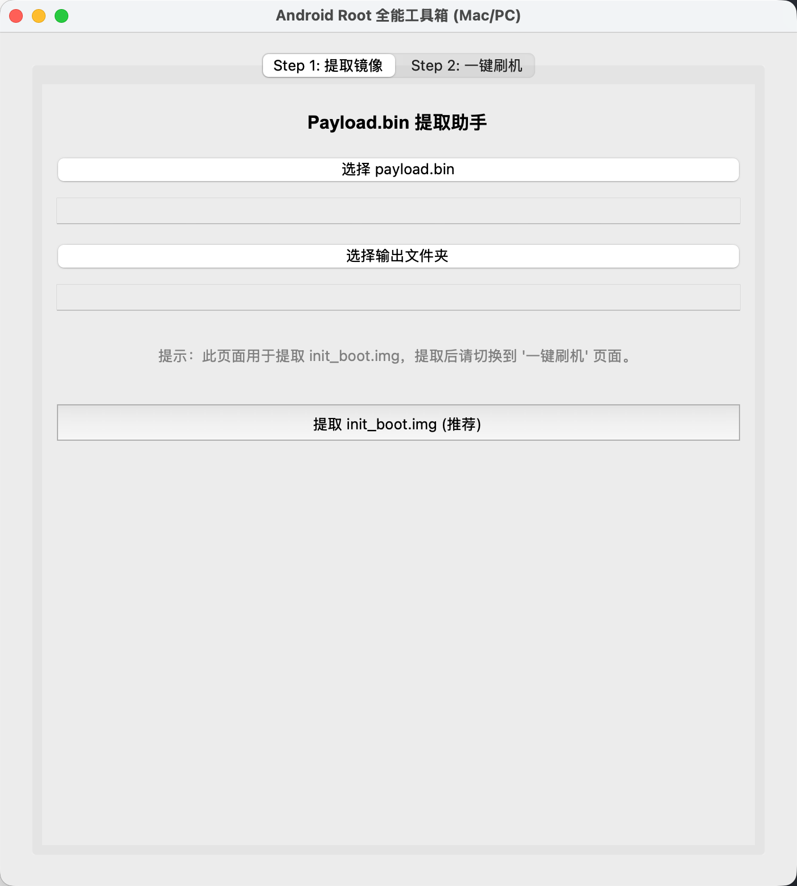
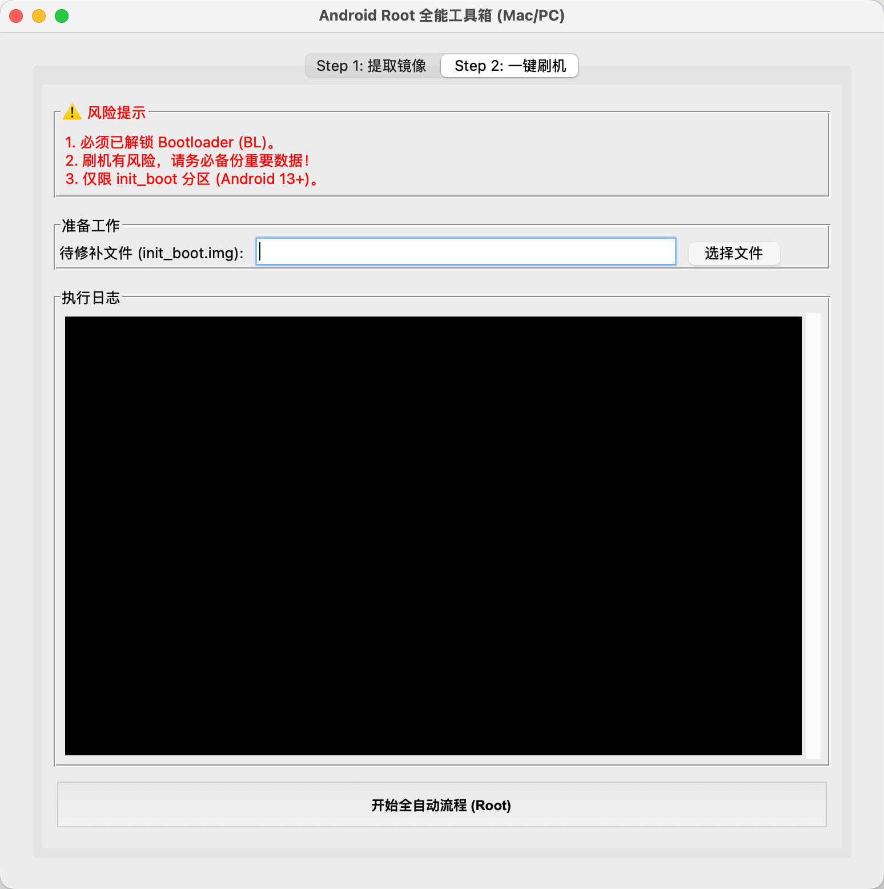

# Android-Root-Toolkit-Mac

一个专为 macOS 用户打造的 Android `init_boot` 提取与一键 Root 工具。
无需记忆复杂的 ADB 命令，全图形化界面，小白也能轻松搞定 Root。

> **🤖 特别致谢 / Credits**
>
> 本项目的核心代码完全由 **Google Gemini 3 Pro** 模型编写生成。
> This project's core code was entirely generated by the **Google Gemini 3 Pro** model.

## ✨ 主要功能 (Features)

* **傻瓜式操作**：双击运行，无需配置 Python 环境。
* **镜像提取**：基于 `payload-dumper-go`，从全量包自动提取 `init_boot.img`。
* **自动化流**：自动推送文件到手机 -> 等待 Magisk 修补 -> 自动拉取 -> 自动刷入。
* **安全引导**：内置脚本自动修复 macOS 的权限与 Gatekeeper 拦截问题。

## 📸 运行截图 (Screenshots)

### 第一步：提取镜像 (Step 1: Extract)

### 第二步：一键刷机 (Step 2: Flash)

## 🚀 如何使用 (How to Use)

1.  在右侧 **Releases** 页面下载最新版本的 ZIP 压缩包。
2.  解压文件。
3.  **右键点击** `启动器.command` -> 选择 **打开**。
4.  按照界面提示操作即可。

## ⚠️ 注意事项 (Disclaimer)

* 刷机有风险，请务必备份重要数据。
* 手机必须已解锁 Bootloader。
* 仅适用于 Android 13/14+ 使用 `init_boot` 分区的机型。
* 作者不对因使用本工具造成的任何设备损坏负责。

---
*Created by [你的名字] with the help of AI.*
